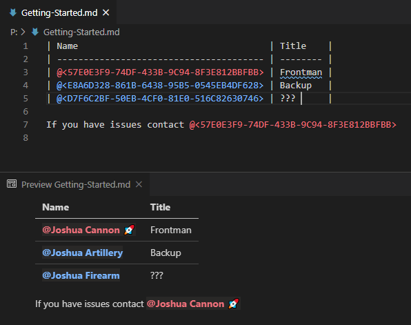
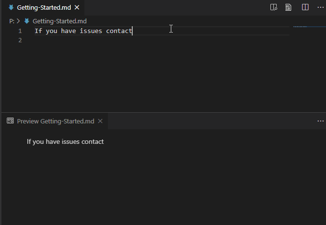
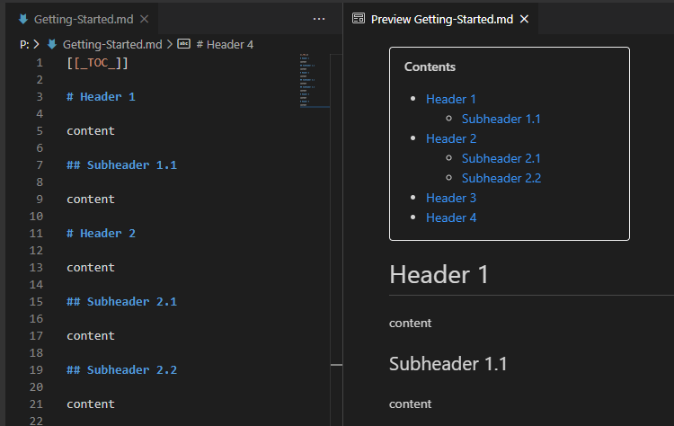
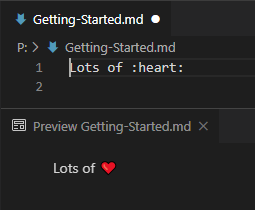

# NI Markdown Editor for Microsoft Azure DevOps Wiki Files


A VS Code extension that makes your local editing of Microsoft Azure DevOps Wiki files easier.

# Features

## User GUIDs: Editor Decoration & Markdown Previewing



NOTE: If the previewer opens before the query finishes, it will stylize the GUIDs but not replace them with the user's name. The next time the previewer updates, the change should take effect.

---

## User GUIDs: Lookup by Name


---

## User GUIDs: Autocomplete



NOTE: The autocomplete cache is per-instance of VS Code and only contains entries from AzDO queries (either by recognized GUIDs or by results of the insert command).

---

## Table of Contents: Markdown Previewer



---

## Emoji: Markdown Previewer



---

# Settings

For AzDO GUID handling, the extension needs your organization's name and your [Personal Access Token (PAT)](https://docs.microsoft.com/en-us/azure/devops/organizations/accounts/use-personal-access-tokens-to-authenticate?view=azure-devops&tabs=preview-page).

```json
{
  "azdo-wiki-md": {
    "organization": "ni",
    "token": "..."
  }
}
```

NOTE: To use the insert command, the PAT needs **full access** (unfortunately the permission required is not available through the Web UI). For normal lookup by GUID, only "Identity - Read" permission is necessary.
